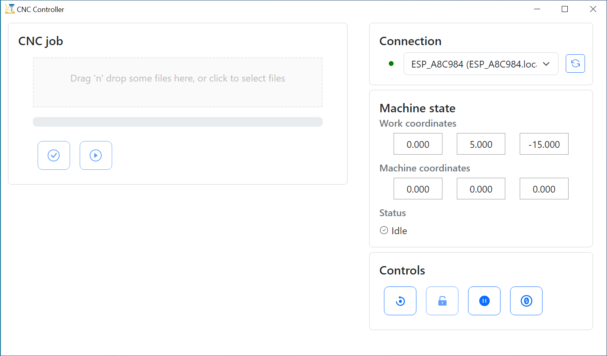

# cnc-controller

Electron app for controlling GRBL CNC machine and running CNC jobs.

## How to use it

1. Grab the ESP-01 board and flash it with [CNCD firmware](https://github.com/wireless-cnc/cncd-esp01)
2. Insert ESP-01 into the slot, the arrow on the top side shows the direction of the ESP-01 antenna
3. Connect the board with the CNC Controller Board using [Offline Controller's cable](https://docs.sainsmart.com/article/zinzutpbhg-genmitsu-3018-pro-offline-controller-guide)
4. Power on CNC
5. Configure WiFi connection of CNCD 
6. Install and run [Wireless CNC Controller](https://github.com/wireless-cnc/cnc-controller/releases)
7. Now you can upload CNC job to controller and launch it!

## OS support

* currently supports Windows 10 and newer
* tested on Windows 10

## Features

* automatically discovers CNC in your home network by using mDNS query
* tracks CNC job progress
* tracks CNC state: alarm, reset , hold, etc

## Credits

<a href="https://www.flaticon.com/free-icons/cnc-machine" title="cnc-machine icons">Cnc-machine icons created by Smashicons - Flaticon</a>
